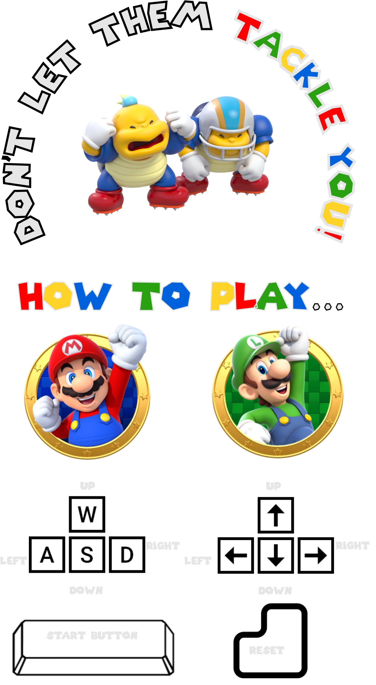

# Don't let them tackle you!

Don't let them tackle you!, is a local multiplayer minigame, created as my project of module 1 in Ironhanck.

I love american football and videogames, so why not to make a little **videogame** about football and one of the most famous characters of all the timens in videogames history.

[Logo](imagenes/tackleLogo.png)

## How it works...

Well is a peace of cake, it doesn't have too much science.

Each player can move around the football field, "W, A, S, D" and the "Arrows button" will take care of that... but nothing in life is easy so, be careful with the Placapums that are running through the field trying to **tackle you!**

Each player have 3 lifes, so try not to finish all of them.

The last man standing wins, so watch out because your rival can hinder you.

##Created by:
**Eduardo Zamarrón**

##Thanks for playing!
